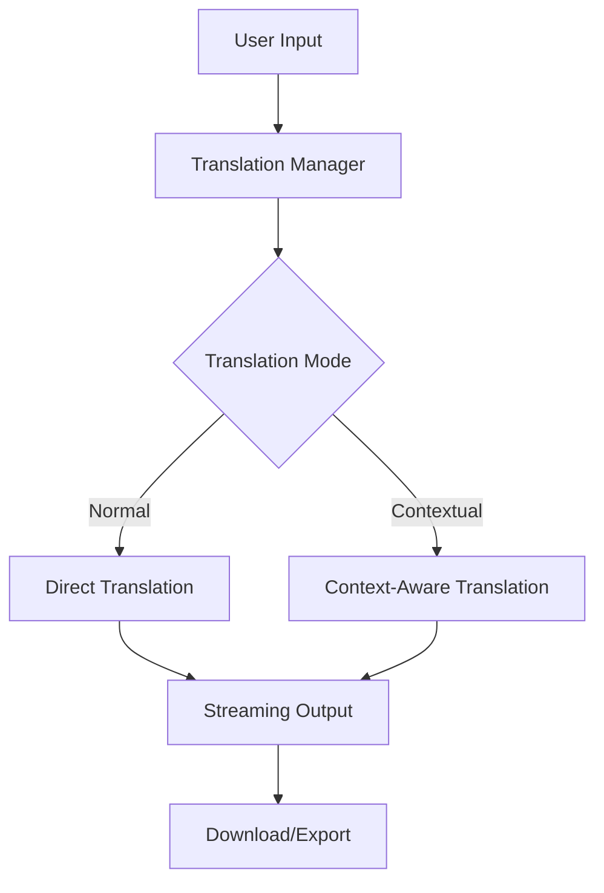

# 🚀 AI-Powered Smart Translator

## 📝 Description

An advanced **Streamlit-based multilingual translation tool** that supports **12+ languages** with **real-time streaming translation** and **context-aware translation**. Built using the **Groq API and TextBlob**, it offers **customizable tone options** and **asynchronous processing** for efficient translation.

## ✨ Features

- 🌍 **Supports 12+ Languages**
- 🔄 **Two Translation Modes:**
  - 📝 Normal Translation
  - 🧠 Contextual Translation with tone and domain awareness
- 🗣 **Customizable Translation Tone:**
  - Formal
  - Neutral
  - Informal
- ⚡ **Real-Time Streaming Output**
- 📚 **Domain-Specific Contextual Translation** (Technical, Business, Literary, etc.)
- ♾️ **Handles Large Texts Efficiently** with **Asynchronous Processing**
- 💾 **Export & Download Translations**


## 🚀 Getting Started

### Prerequisites

- Python 3.8 or higher
- Groq API key
- Git

### Installation

1. **Clone the repository**
```bash
git clone https://github.com/YOUR_USERNAME/multilingual-translator.git
cd multilingual-translator
```

2. **Create and activate virtual environment**
```bash
# Windows
python -m venv venv
venv\Scripts\activate

# Linux/Mac
python -m venv venv
source venv/bin/activate
```

3. **Install dependencies**
```bash
pip install -r requirements.txt
```

4. **Set up environment variables**
Create a `.env` file in the project root:
```plaintext
GROQ_API_KEY=your_groq_api_key_here
```

5. **Run the application**
```bash
streamlit run translator2app.py
```

## 💻 Usage

1. Select translation mode (**Normal** or **Contextual**).
2. Choose the target language.
3. Pick a translation tone (**Formal, Neutral, Informal**).
4. Enter the text to translate.
5. Click **Translate** and view **real-time streaming output**.
6. Download or copy the translation.

## 🛠️ Technical Architecture



## 📂 Project Structure

```
multilingual-translator/
├── app.py              # Main application file
├── .env                # Environment variables
├── requirements.txt    # Dependencies
├── README.md           # Documentation
```

## 🔮 Future Advancements

- 🗣 **Speech-to-Text Integration**: Enable voice input for translation.
- 📱 **Mobile App Development**: Extend functionality to iOS & Android.
- 🤖 **Enhanced AI Models**: Improve translations with more advanced AI models.
- 🌐 **Offline Translation Mode**: Allow translations without an internet connection.
- 🏆 **Personalized Learning**: Adaptive learning for better context and accuracy.
- 🔗 **Integration with External APIs**: Connect with chatbots, websites, and more.

## 🤝 Contributing

1. Fork the repository
2. Create your feature branch (`git checkout -b feature/AmazingFeature`)
3. Commit your changes (`git commit -m 'Add some AmazingFeature'`)
4. Push to the branch (`git push origin feature/AmazingFeature`)
5. Open a Pull Request

## 🙏 Acknowledgments

- **Groq API** for translation capabilities
- **Streamlit** for the web interface
- **TextBlob** for language detection

---

